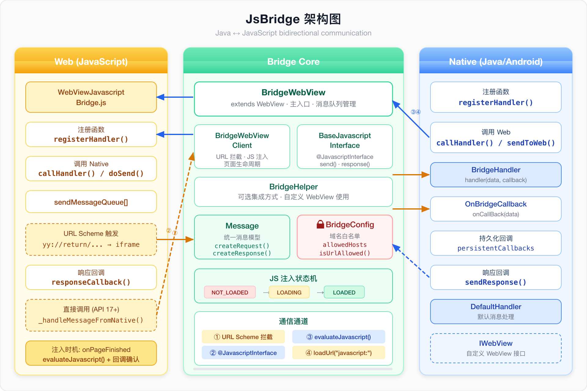
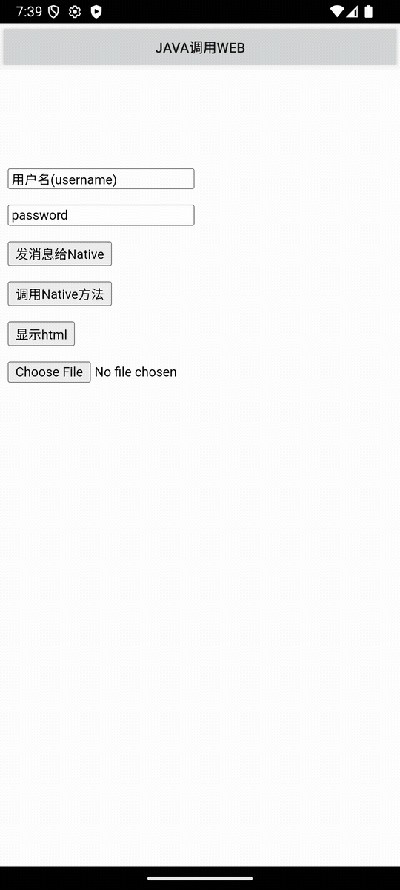

# JsBridge

Android WebView 与 JavaScript 双向通信桥接库。

A bridge between Java and JavaScript for Android WebView, providing safe bidirectional communication.

[English](#english) | [中文文档](#中文文档)

## Architecture


## Demo


---

<a id="english"></a>

## Installation

```groovy
// settings.gradle or build.gradle (project level)
repositories {
    maven { url "https://jitpack.io" }
}

// build.gradle (module level)
dependencies {
    implementation 'com.github.happydog-intj:JsBridge:v2.1.0'
}
```

## Quick Start (BridgeWebView)

Add `BridgeWebView` to your layout:

```xml
<com.github.lzyzsd.jsbridge.BridgeWebView
    android:id="@+id/webView"
    android:layout_width="match_parent"
    android:layout_height="match_parent" />
```

Initialize in your Activity:

```java
BridgeWebView webView = findViewById(R.id.webView);
webView.setGson(new Gson());

// Register @JavascriptInterface handler
webView.addJavascriptInterface(
    new MainJavascriptInterface(
        webView.getCallbacks(),
        webView.getPersistentCallbacks(),
        webView),
    "WebViewJavascriptBridge");

webView.loadUrl("file:///android_asset/demo.html");
```

### Java → JavaScript

Register a JS handler, then call it from Java:

```javascript
// JavaScript: register a handler
WebViewJavascriptBridge.registerHandler("functionInJs", function(data, responseCallback) {
    document.getElementById("show").innerHTML = "data from Java: = " + data;
    responseCallback("Javascript Says Right back aka!");
});
```

```java
// Java: call the JS handler
webView.callHandler("functionInJs", new Gson().toJson(user), new OnBridgeCallback() {
    @Override
    public void onCallBack(String data) {
        Log.d(TAG, "response from JS: " + data);
    }
});
```

### JavaScript → Java

Register a `@JavascriptInterface` method, then call it from JS:

```java
// Java: create a JavascriptInterface class
public class MainJavascriptInterface extends BridgeWebView.BaseJavascriptInterface {

    private WebViewJavascriptBridge mWebView;

    public MainJavascriptInterface(Map<String, OnBridgeCallback> callbacks,
                                   Map<String, OnBridgeCallback> persistentCallbacks,
                                   WebViewJavascriptBridge webView) {
        super(callbacks, persistentCallbacks);
        mWebView = webView;
    }

    @Override
    public String send(String data) {
        return "default response";
    }

    @JavascriptInterface
    public void submitFromWeb(String data, String callbackId) {
        Log.d("JSInterface", "data from web: " + data);
        mWebView.responseFromWeb("response from Java", callbackId);
    }
}
```

```javascript
// JavaScript: call the Java handler
WebViewJavascriptBridge.callHandler(
    'submitFromWeb',
    {'param': 'value'},
    function(responseData) {
        document.getElementById("show").innerHTML = "response: " + responseData;
    }
);
```

### Persistent Callbacks

By default, callbacks are removed after first invocation. Use persistent callbacks for multi-response scenarios (real-time updates, event streams):

```java
// Java: callback survives multiple invocations
webView.callHandlerPersistent("functionInJs", data, new OnBridgeCallback() {
    @Override
    public void onCallBack(String data) {
        Log.d(TAG, "called again: " + data);  // can be called multiple times
    }
});
```

### Domain Whitelist (Security)

Restrict which origins can call native methods through the bridge. When a whitelist is set, only pages from allowed hosts can invoke `@JavascriptInterface` methods:

```java
// Only allow your own domains
webView.addAllowedHost("example.com");
webView.addAllowedHost("*.example.com");  // wildcard for subdomains

// Or set all at once
Set<String> hosts = new HashSet<>(Arrays.asList("app.com", "*.app.com"));
webView.setAllowedHosts(hosts);

// Or use BridgeConfig for full control
BridgeConfig config = new BridgeConfig();
config.addAllowedHost("example.com");
webView.setBridgeConfig(config);
```

When the whitelist is empty (default), all origins are allowed — fully backward compatible.

---

## BridgeHelper (Custom WebView Integration)

If you need JsBridge on a custom `WebView` (not `BridgeWebView`), use `BridgeHelper`:

### Step 1: Implement `IWebView`

```java
public class CustomWebView extends WebView implements WebViewJavascriptBridge, IWebView {

    private BridgeHelper bridgeHelper;

    public CustomWebView(Context context) {
        super(context);
        init();
    }

    private void init() {
        getSettings().setJavaScriptEnabled(true);
        bridgeHelper = new BridgeHelper(this);

        setWebViewClient(new WebViewClient() {
            @Override
            public void onPageStarted(WebView view, String url, Bitmap favicon) {
                super.onPageStarted(view, url, favicon);
                bridgeHelper.onPageStarted();  // reset JS injection state
            }

            @Override
            public void onPageFinished(WebView view, String url) {
                bridgeHelper.onPageFinished();  // inject bridge JS + flush queue
            }

            @Override
            public boolean shouldOverrideUrlLoading(WebView view, String url) {
                return bridgeHelper.shouldOverrideUrlLoading(url);
            }
        });
    }

    // Delegate bridge methods
    @Override
    public void sendToWeb(String data, OnBridgeCallback responseCallback) {
        bridgeHelper.sendToWeb(data, responseCallback);
    }

    public void callHandler(String handlerName, String data, OnBridgeCallback callBack) {
        bridgeHelper.callHandler(handlerName, data, callBack);
    }

    public void registerHandler(String handlerName, BridgeHandler handler) {
        bridgeHelper.registerHandler(handlerName, handler);
    }

    // ... other WebViewJavascriptBridge methods

    @Override
    public WebView getWebView() { return this; }
}
```

### Step 2: Use domain whitelist with BridgeHelper

```java
CustomWebView webView = findViewById(R.id.webView);
webView.bridgeHelper.addAllowedHost("example.com");
```

---

## JavaScript Setup

The bridge JS is injected automatically on page load. Wait for it:

```javascript
function setupWebViewJavascriptBridge(callback) {
    if (window.WebViewJavascriptBridge) {
        return callback(WebViewJavascriptBridge);
    }
    if (window.WVJBCallbacks) {
        return window.WVJBCallbacks.push(callback);
    }
    window.WVJBCallbacks = [callback];
}

// Usage
setupWebViewJavascriptBridge(function(bridge) {
    bridge.registerHandler('JS Echo', function(data, responseCallback) {
        console.log("JS Echo called with:", data);
        responseCallback(data);
    });
});
```

Or listen for the ready event:

```javascript
if (window.WebViewJavascriptBridge) {
    // bridge is ready
} else {
    document.addEventListener('WebViewJavascriptBridgeReady', function() {
        // bridge is now ready
    }, false);
}
```

---

<a id="中文文档"></a>

## 中文文档

### 安装

```groovy
// settings.gradle 或 build.gradle (项目级)
repositories {
    maven { url "https://jitpack.io" }
}

// build.gradle (模块级)
dependencies {
    implementation 'com.github.happydog-intj:JsBridge:v2.1.0'
}
```

### 快速开始 (BridgeWebView)

在布局中添加 `BridgeWebView`：

```xml
<com.github.lzyzsd.jsbridge.BridgeWebView
    android:id="@+id/webView"
    android:layout_width="match_parent"
    android:layout_height="match_parent" />
```

在 Activity 中初始化：

```java
BridgeWebView webView = findViewById(R.id.webView);
webView.setGson(new Gson());

// 注册 @JavascriptInterface
webView.addJavascriptInterface(
    new MainJavascriptInterface(
        webView.getCallbacks(),
        webView.getPersistentCallbacks(),
        webView),
    "WebViewJavascriptBridge");

webView.loadUrl("file:///android_asset/demo.html");
```

### Java 调用 JavaScript

先在 JS 端注册 handler，然后 Java 端调用：

```javascript
// JS 端: 注册 handler
WebViewJavascriptBridge.registerHandler("functionInJs", function(data, responseCallback) {
    console.log("收到 Java 数据: " + data);
    responseCallback("来自 JS 的响应");
});
```

```java
// Java 端: 调用 JS handler
webView.callHandler("functionInJs", "来自Java的数据", new OnBridgeCallback() {
    @Override
    public void onCallBack(String data) {
        Log.d(TAG, "JS 响应: " + data);
    }
});
```

### JavaScript 调用 Java

创建 `@JavascriptInterface` 类，JS 端即可调用：

```java
// Java 端: 自定义 JavascriptInterface
public class MainJavascriptInterface extends BridgeWebView.BaseJavascriptInterface {

    private WebViewJavascriptBridge mWebView;

    public MainJavascriptInterface(Map<String, OnBridgeCallback> callbacks,
                                   Map<String, OnBridgeCallback> persistentCallbacks,
                                   WebViewJavascriptBridge webView) {
        super(callbacks, persistentCallbacks);
        mWebView = webView;
    }

    @Override
    public String send(String data) {
        return "默认响应";
    }

    @JavascriptInterface
    public void submitFromWeb(String data, String callbackId) {
        Log.d("JSInterface", "收到 Web 数据: " + data);
        mWebView.responseFromWeb("来自 Java 的响应", callbackId);
    }
}
```

```javascript
// JS 端: 调用 Java handler
WebViewJavascriptBridge.callHandler(
    'submitFromWeb',
    {'param': 'value'},
    function(responseData) {
        console.log("收到 Java 响应: " + responseData);
    }
);
```

### 持久化回调

默认回调在首次调用后自动删除。使用持久化回调实现多次响应（如实时更新、事件流）：

```java
// Java 端: 回调不会在首次调用后删除
webView.callHandlerPersistent("functionInJs", data, new OnBridgeCallback() {
    @Override
    public void onCallBack(String data) {
        Log.d(TAG, "再次收到: " + data);  // 可被多次调用
    }
});
```

### 域名白名单（安全特性）

限制哪些域名可以通过 bridge 调用 native 方法。设置白名单后，只有允许的域名才能调用 `@JavascriptInterface`：

```java
// 只允许自己的域名
webView.addAllowedHost("example.com");
webView.addAllowedHost("*.example.com");  // 支持通配符匹配子域名

// 或者一次性设置
Set<String> hosts = new HashSet<>(Arrays.asList("app.com", "*.app.com"));
webView.setAllowedHosts(hosts);
```

白名单为空时（默认），所有域名均允许 —— 完全向后兼容。

### 使用 BridgeHelper 自定义 WebView

如果你需要在自定义 WebView 上使用 JsBridge（而非直接使用 `BridgeWebView`），可以用 `BridgeHelper`：

```java
public class CustomWebView extends WebView implements WebViewJavascriptBridge, IWebView {

    private BridgeHelper bridgeHelper;

    public CustomWebView(Context context) {
        super(context);
        init();
    }

    private void init() {
        getSettings().setJavaScriptEnabled(true);
        bridgeHelper = new BridgeHelper(this);

        setWebViewClient(new WebViewClient() {
            @Override
            public void onPageStarted(WebView view, String url, Bitmap favicon) {
                super.onPageStarted(view, url, favicon);
                bridgeHelper.onPageStarted();  // 重置注入状态
            }

            @Override
            public void onPageFinished(WebView view, String url) {
                bridgeHelper.onPageFinished();  // 注入 bridge JS + flush 消息队列
            }

            @Override
            public boolean shouldOverrideUrlLoading(WebView view, String url) {
                return bridgeHelper.shouldOverrideUrlLoading(url);
            }
        });
    }

    // 委托 bridge 方法到 bridgeHelper
    public void callHandler(String handlerName, String data, OnBridgeCallback cb) {
        bridgeHelper.callHandler(handlerName, data, cb);
    }

    public void registerHandler(String handlerName, BridgeHandler handler) {
        bridgeHelper.registerHandler(handlerName, handler);
    }

    @Override
    public WebView getWebView() { return this; }

    // ... 其他 WebViewJavascriptBridge 接口方法
}
```

**关键要点：**
- `onPageStarted()` 中调用 `bridgeHelper.onPageStarted()` 重置注入状态
- `onPageFinished()` 中调用 `bridgeHelper.onPageFinished()` 注入 JS 并 flush 队列
- `shouldOverrideUrlLoading()` 中调用 `bridgeHelper.shouldOverrideUrlLoading(url)` 拦截 bridge URL

### JS 端设置

Bridge JS 会在页面加载完成后自动注入。使用以下方式等待 bridge 就绪：

```javascript
function setupWebViewJavascriptBridge(callback) {
    if (window.WebViewJavascriptBridge) {
        return callback(WebViewJavascriptBridge);
    }
    if (window.WVJBCallbacks) {
        return window.WVJBCallbacks.push(callback);
    }
    window.WVJBCallbacks = [callback];
}

// 使用
setupWebViewJavascriptBridge(function(bridge) {
    bridge.registerHandler('myHandler', function(data, responseCallback) {
        console.log("收到数据:", data);
        responseCallback("处理完成");
    });
});
```

### 通信通道

JsBridge 支持 4 种通信通道（参见架构图）：

| # | 通道 | 方向 | 说明 |
|---|------|------|------|
| ① | URL Scheme 拦截 | JS → Java | JS 通过 iframe 触发 `yy://` scheme，Java 端 `shouldOverrideUrlLoading` 拦截 |
| ② | @JavascriptInterface | JS → Java | JS 直接调用 Java 注册的 `@JavascriptInterface` 方法（API 17+） |
| ③ | evaluateJavascript() | Java → JS | Java 调用 `evaluateJavascript()` 执行 JS 代码（API 19+） |
| ④ | loadUrl("javascript:") | Java → JS | 低版本兼容方案，通过 `loadUrl` 执行 JS |

### JS 注入生命周期

```
onPageStarted → 状态重置为 NOT_LOADED，消息队列恢复
                     ↓
onPageFinished → 注入 bridge JS (evaluateJavascript)
                     ↓  状态: LOADING
              注入完成回调 → 状态: LOADED，flush 消息队列
```

在 JS 注入完成前发送的消息会自动排队，注入完成后统一派发 —— 不再丢消息。

---

## Compatibility / 兼容性

### Android 11+ (API 30+)

JsBridge v2.1.0 已适配 Android 11+：

- `setAllowFileAccessFromFileURLs(false)` / `setAllowUniversalAccessFromFileURLs(false)` 默认关闭（与 API 30+ 行为一致）
- 如果你的页面通过 `file://` 加载且需要跨文件访问，请在初始化后手动开启：

```java
webView.getSettings().setAllowFileAccessFromFileURLs(true);
```

- `clearCache(true)` 和 `LOAD_NO_CACHE` 已从默认 `init()` 移除 —— 缓存策略应由宿主 App 决定
- `setDomStorageEnabled(true)` 默认开启

### HarmonyOS / 鸿蒙

本项目为 Android 平台库。HarmonyOS 版本请参考社区移植：

- **ohpm**: [`@alvin917/jsbridge`](https://ohpm.openharmony.cn/#/cn/detail/@alvin917%2Fjsbridge)

### WebView 创建崩溃 (rk3568 等嵌入式设备)

如果遇到 `WebViewFactory` / `InflateException` 错误，通常是设备的 WebView 提供程序未正确安装或版本过低（常见于 Rockchip 等嵌入式开发板）。这不是 JsBridge 的问题，解决方法：

1. 在设备上安装/更新 Chrome 或 Android System WebView
2. 确认 `adb shell dumpsys webviewupdate` 输出正常
3. 嵌入式设备需要系统集成商预装 WebView APK

---

## v2.1.0 Changelog

### Bug Fixes
- **#175**: 修复 URL decode 破坏非 bridge URL 查询参数（如支付宝 deep link）
- **#265**: 修复消息队列在错误时机被清除
- **#209**: 修复 init 后不能立即调用 JS 方法
- **#250**: 修复频繁发消息导致 Throttling navigation 报错
- **#170**: 修复初始化时消息偶发性丢失
- **#271**: 修复 CustomWebView (BridgeHelper) 生命周期管理

### New Features
- 持久化回调: `callHandlerPersistent()`
- 域名白名单: `BridgeConfig` + `addAllowedHost()`
- 统一消息模型: `Message.createRequest()` / `createResponse()`
- JS 注入状态机: `NOT_LOADED → LOADING → LOADED`
- 使用 `evaluateJavascript()` + 回调确认注入完成

### Security / Compatibility
- 移除 `init()` 中的 `clearCache(true)` 和 `LOAD_NO_CACHE`（不再强制清除应用缓存）
- 默认禁用 `setAllowFileAccessFromFileURLs` / `setAllowUniversalAccessFromFileURLs`（Android 11+ 安全加固）
- 默认启用 `setDomStorageEnabled(true)`

### Build
- **#275**: 修复 duplicate class，仅发布 release AAR
- 版本号: 2.1.0

## License

This project is licensed under the terms of the MIT license.
